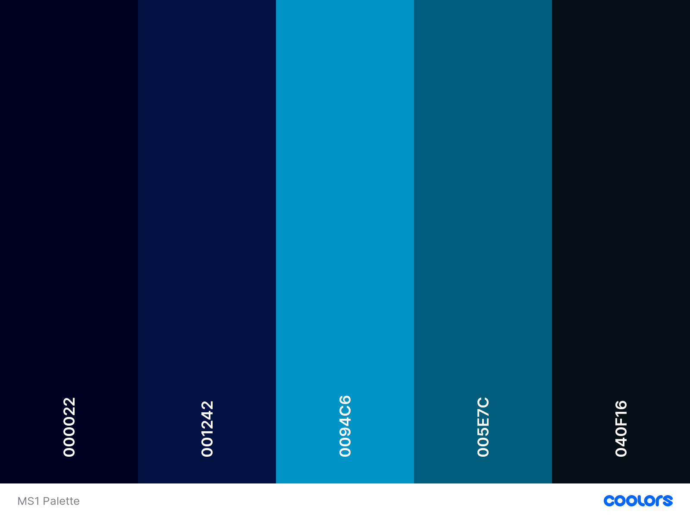

# Galway Beer and Whiskey Tours

# Contents
* UX

# UX

## Strategy 

### Project Goals

The central goal is to create a fictional business to customer website that offers a unique tourist experience of Galway city through the medium of organized tours of the city's pub scene. The business function of the site is to create brand awareness which will be enhanced by linking the site to various social media accounts and also to Tripadvisor so the user can access accounts of previous customer experiences. There will also be a testimonial section on the landing page which in
tandem with tripadvisor will be used to heighten the percived value of the business. The primary function of the social
meet-ups page is to generate and enhance the social currency of the website and explore another possible future business
venture if the meet-ups proved popular among users. What makes this idea special or even viable? Studies have consistently
shown that the millenial generation prefer spending their income on experiences rather than material objects and this 
generation also happens to be in possession of considerable disposable income. Galway's tourist industry is booming and 
this idea appeals an experience orientated tourist by exploiting Galway's primary tourism asset: its nightlife. 

**The Strategy for achieving the above business goals is as follows:**
* Creating an online presence for Galway Beer and Whiskey Tours.
* Offering a comprehensive list of tours provided.
* Offering free social events to generate consistent and repeat traffic to the website.
* Creating simple, easy UX to enhance the customer's ease of use and promote a postive emotional response.
* Choosing images that generate a postive emotional response that appeals to the user's imagination so that 
  they can visualise themselves taking part in a tour or attending a meet-up. The desired effect of this is to encourage 
  the user to purchase the product within the first few visits to the site. 

### Customer Goals
Prospective users :

* Are in search of tourist activities in Galway city.
* Want a clear outline of tours provided.
* Desire clear and affordable services.
* Are new to the city and in search of a social community.
* Want easy to contact service providers.

## Scope

**The Ideal User of this website is:**
* Visiting or new to the city.
* Enjoys socialising.
* Has an interest in Irish pub culture.
* Has dispoable income which they enjoy spending on unique experiences.
* Is interested in making new social connections.

### User Stories
* As a first time user I want to find out information about guided tours of Galway city.
* As a first time user I want to be able to communicate with the service user easily and efficiently.
* As a new user I want to discover what social meet-ups the website offers to people who have just moved to the city.
* As a returning user I want to be able to connect with Galway Beer and Whiskey Tours on social media so I can 
  catch any new updates on my social media.
* As a returning user I want to be able to check for updates about weekly social meet-ups.
* As a potential client I want to find a comprehensive description of the tours offered and clear price rates 
  should I choose to take part in a tour.
* As a potential client I want to find a fun and unique activity to do during my holiday to Galway. 

## Structure

### Design

**Typograpghy**
I chose the 'Special Elite' font because it reminded of the fonts used on old-style beer labels which helps 
with the aesthetic I wanted to create. I contrasted this with the 'Zilla Slab' font in order to complement the 
'Special Elite' font and also to maintain some style neutrality in order to prevent a style overload on the website.
I added a text shadow to the h3 text on mobile screen because the original text was quite difficult to view against the 
background image. 

**Colours**
I chose my color palette using the https://coolors.co website which my mentor had recommended. I chose these colors because
I felt the palette best represented what the website offered, a friendly exploration of Galway's pub scene and night life.

**Display**
I chose this particular dropdown style of navigation having originally wanted to use a 'hamburger' style navigation bar but without Javascript this proved 
a little beyond the current scope of achievement. 

### Technologies
* HTML
* CSS

## Features

## Testing

### Known Bugs and Issues
* I had difficulty resizing the color palette using solely markdown and referred the issue to the slack community where
  Kasia kindly helped to resolve the issue by recommending the  tag instead.  

## Deployment

## Credits

### Media
* The banner image was originally obtained from [Jared Burris on unsplash.com](https://unsplash.com/photos/Kzq3JphxXiA) 
* The whiskey.jpg image was originally obtained from [Andrew Seaman on upsplash.com](https://unsplash.com/photos/3Vb7WtHGRes)
* The barflair.pg image was originally obtained from [Bon Vivant on unsplash.com](https://unsplash.com/photos/FcS257Cw9es)
* The people.jpg image was originally obtained from [Elevate on upsplash.com](https://unsplash.com/photos/KJzrLIfq2Zo)
* The bar.jpg image was originally obtained from [Alexander Jawfox on upsplash.com](https://unsplash.com/photos/ts2e1Dia5Ec)
* The galway.jpg image was originally obtained from [Markus Voetter on upsplash.com](https://unsplash.com/photos/s12s4dZSwLk)
* The language.jpg image was originally obtained from [Elevate on upsplash.com](https://unsplash.com/photos/UoPNA8I-_p0)