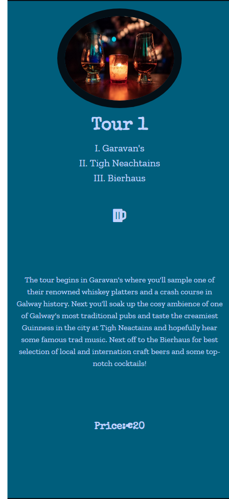
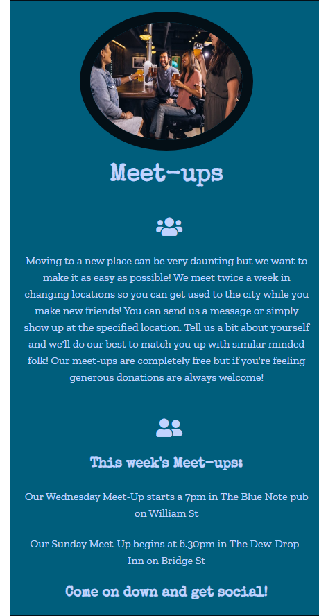
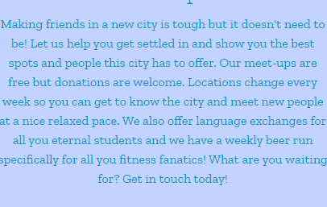
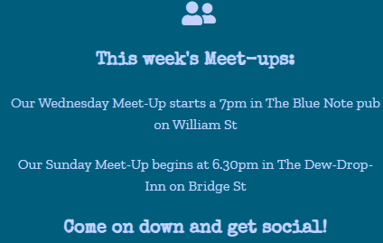
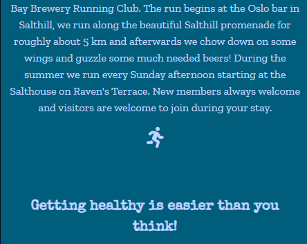

# Contents
* [UX](#UX)
    * [Strategy](#Strategy)
       * [Project Goals](#Project-Goals)
       * [Customer Goals](#Customer-Goals)
       * [User Stories](#User-Stories) 
    * [Structure](#Structure)
       * [Features](#Features) 
         * [Home Page](#Home-Page)
         * [Tour Page](#Tour-Page)
         * [Meetups Page](#Meetups-Page)
         * [Contact Page](#Contact-Page)
        * [Existing Features](#Existing-Features)
        * [Design](#Design)
    * [Skeleton](#Skeleton)
      * [Wireframes](#Wireframes)
      * [Technolgies Used](#Technologies-Used)
    * [Testing](#Testing)
      * [Testing User Stories](#Testing-User-Stories)
      * [Known Bugs and Issues](#Known-Bugs-and-Issues)
    * [Deployment](#Deployment)
      * [Making a clone to run locally](#Making-a-clone-to-run-locally)
    * [Credits](#Credits)
      * [Media](#Media)
      * [Code](#Code)
      * [Acknowledgements](#Acknowledgements)

# Galway Beer and Whiskey Tours

The live website can be viewed [here](https://aideenm12.github.io/Galway-Tours-MS1/)

# UX

## Strategy 

### Project Goals

The central goal is to create a fictional business to customer website that offers a unique tourist experience of Galway city through the medium of organized tours of the city's pub scene. The business function of the site is to create brand awareness which will be enhanced by linking the site to various social media accounts and also to Tripadvisor so the user can access accounts of previous customer experiences. There will also be a testimonial section on the landing page which in
tandem with tripadvisor will be used to heighten the percived value of the business. The primary function of the social
meet-ups page is to generate and enhance the social currency of the website and explore another possible future business
venture if the meet-ups proved popular among users. What makes this idea special or even viable? Studies have consistently
shown that the millenial generation prefer spending their income on experiences rather than material objects and this 
generation also happens to be in possession of considerable disposable income. Galway's tourist industry is booming and 
this idea appeals an experience orientated tourist by exploiting Galway's primary tourism asset: its nightlife. 

**The Strategy for achieving the above business goals is as follows:**
* Creating an online presence for Galway Beer and Whiskey Tours.
* Offering a comprehensive list of tours provided.
* Offering free social events to generate consistent and repeat traffic to the website.
* Creating simple, easy UX to enhance the customer's ease of use and promote a postive emotional response.
* Choosing images that generate a postive emotional response that appeals to the user's imagination so that 
  they can visualise themselves taking part in a tour or attending a meet-up. The desired effect of this is to encourage 
  the user to purchase the product within the first few visits to the site. 

### Customer Goals
Prospective users :

* Are in search of tourist activities in Galway city.
* Want a clear outline of tours provided.
* Desire clear and affordable services.
* Are new to the city and in search of a social community.
* Want easy to contact service providers.

**The Ideal User of this website is:**
* Visiting or new to the city.
* Enjoys socialising.
* Has an interest in Irish pub culture.
* Has dispoable income which they enjoy spending on unique experiences.
* Is interested in making new social connections.

### User Stories
* As a first time user I want to find out information about guided tours of Galway city.
* As a first time user I want to be able to communicate with the service user easily and efficiently.
* As a new user I want to discover what social meet-ups the website offers to people who have just moved to the city.
* As a returning user I want to be able to connect with Galway Beer and Whiskey Tours on social media so I can 
  catch any new updates on my social media.
* As a returning user I want to be able to check for updates about weekly social meet-ups.
* As a potential client I want to find a comprehensive description of the tours offered and clear price rates 
  should I choose to take part in a tour.
* As a potential client I want to find a fun and unique activity to do during my holiday to Galway. 

# Structure

## Features

The website is divided into four separate pages. A home page, a tours page, a meet-ups page and a contact page. Each page has the same heading located on the left with navigation located on the right on the same row. Each page has the same footer with social media icon links on the right and the webpage title to the left. The same hero image is used on each page and located directly beneath the navigation bar. A row of navigation links are located directly below the hero image also. 

#### Home Page.

The home page gives a general overview of the content offered by the site. There is an About section beneath the hero image which explains what the site is and what it does. Beneath the About section is a testimonials section designed to promote a positive response from potential customers because it provides them with positive feedback of the site from other users. Beneath the testimonials section is a continuation of the About section which provides more detail about the tours and meet-ups pages. The home page is designed to give users all the information that they need so that when they visit the rest of they site they are not overwhelmed by information and so that they are fully aware of what is being offered without having to search for extra information. On mobile devices the hero image is resized a placed as the background image to maintain style integrity. The testimonials section is removed from mobile devices so as not to overload the user with too much reading. Each paragraph is presented with an opaque background that follows the site's color palette in a more suitable design for mobile screens. 

#### Tours page.

The tours page provides all the required information a user need to before booking a tour. Beneath the hero image three separate tours are presented side by side starting from the smallest and cheapest to the longest and most expensive. The price range stretches from 20 euro to 60 euro to suit the disposable income of the targeted demographic and is highlighted at the end of each tour description to avoid lack of clarity. Each tour is described in depth. Locations are listed at the top of the description and what occurs on each tour is described beneath the list to allow the user to take in as much or as little information as they require before booking a tour. At the top of each tour description is an image specifically chosen because it accurately represents the product being offered and it matches the color scheme. Like the home page, the tours page uses an image as its background on mobile devices but this time the image chosen is of two whiskeys by candlelight so as to offer the user another visual representation of what is being offered. Beneath the tour descriptions is an image of Galway harbour at night which was chosen because it is fits the aesthetic of the site and also the content of the site. 

#### Meetups Page.

The meet-ups page is very similar to the tours page in terms of desktop layout. Beneath the hero image three separate social activites are presented side by side. An image of the activity is presented above the description each activity to allow the user to become more familiar with what is being offered. The activities described are as follows, a social meet-up for people who are new to the city or want to make new friends, a language exchange for those that like to blend learning and socialising and fianlly a beer run for those that enjoy exercising as a means of socialising. Locations for each activity along with times are clearly provided so as to avoid causing the user any confusion. The beer run and social meet-ups are both free of charge and are designed to encourage returning users and boost the popularity of the site through word of mouth. The image of Galway harbour is also located beneath the descriptions offered on this site.

#### Contact page.

The contact page presents the user with a simple contact form with a submit button at the bottom which they can use to contact the owners of the site in order to book a tour or simply enquire about one of the social activities. Each field has been marked as required to avoid the possibility of an error when trying to contact the owners of the site. The contact form is placed against the background image of Galway Harbour so as to effectively reuse the imagery chosen by the developer to maintain design integrity and promote a positive user experience. 

### Existing Features
* The title header is located on left of every page. It's function is to build and promote brand awareness whilst also creating a positive emotional response from the user by showcasing the color-scheme and typography specifically chosen for the brand.

* The navigation bar is located to the left of the title header on every page. It is located where a user would expect to find it to promote ease of use and easy navigation. Bootstrap technology allows it to collapse into a hamburger style on mobile devices again to match the expectation of the user and also make efficient use of screen space on smaller screens.

* The hero image is located on the desktop version of each page. It was chosen because it accurately represents the product being offered and it was used by the developer to chose the overall color-scheme. The image is of the bar in a traditional Galway pub and offers users a visual representation of the product being offered. 

* Directly beneath the hero image are three navigation links. These have been put here to create greater accessibility so that no matter what page the user finds themselves on they can click the desired page without having to search. 

* The footer follows the same design as the header. The website title is located on the left and links to Facebook, Instagram and Tripadvisor are stored in the icons to the right. Each of these links opens in a new tab so as to keep the user on the business page longer. A fourth icon is provided and links directly to the contact page so the user doesn't have to search for the contact page. 

### Design

**Typography**
I chose the 'Special Elite' font because it me reminded of the fonts used on old-style beer labels which helps 
with the aesthetic I wanted to create. I contrasted this with the 'Zilla Slab' font in order to complement the 
'Special Elite' font and also to maintain some style neutrality in order to prevent a style overload on the website.
I added a text shadow to the h3 text on mobile screen because the original text was quite difficult to view against the 
background image. 

**Colours**
I chose my color palette using the https://coolors.co website which my mentor had recommended. I chose these colors because
I felt the palette best represented what the website offered, a friendly exploration of Galway's pub scene and night life.

* Oxford Blue - Hex: #000022 | RGB (0, 0, 34)
* Oxford Blue - Hex: #001242 | RGB (0, 18, 66)
* Lavender Blue - Hex: #C1D3FE | RGB (193, 211, 254)
* Blue NCS - Hex: #0094C6 | RGB (0, 148, 198)
* Blue Sapphire - Hex: #005E7C | RGB (0, 94, 124)
* Rich Black FOGRA 29 - Hex: #040F16 | RGB (4, 15, 22)

**Display**
. 
## Skeleton

### Wireframes

* The wireframes were created using [Balsamiq wireframes](https://balsamiq.com/)

* The wireframe mockup links can be found below:

* [Desktop Wireframes](documentation/milestone-1-desktop-wireframes.pdf)

* [Small Screen Wireframes](documentation/milestone-1-smallscreen.pdf)

## Technologies Used
- This project is built using HTML5 semantic markup and CSS stylesheets.
- [Gitpod](https://gitpod.io)
    - This project was built using Gitpod as the IDE.
- [Google fonts](https://fonts.google.com/) 
    - The font styles used on this website were chosen from Google fonts.
- [Bootstrap 4.5](https://getbootstrap.com/)
   - Various aspects of this website were structured using Bootstrap.
   - Bootstrap was used to make this website responsive
- [TinyJPG](https://tinyjpg.com/)
   - The images represented were compressed using TinyJPG in order to improve the performance of the project. 
- [Fontawesome](https://fontawesome.com/)
    - The icons used on this page were found in Fontawesome.
- [Hover.css](https://ianlunn.github.io/Hover/) 
    - The hover feature of the navigation links below the hero image were implemented using Hover.css. 
- [Popper.js](https://popper.js.org/)
    - Certain bootstrap responsive elements require Popper.js in order to function correctly.
- [Balsamiq](https://balsamiq.com/)
    - The wireframes for this project were created using Balsamiq.
- [Unsplash](https://unsplash.com/)
    - The majority of images used in this project were found in Unsplash. 
- [Freeformatter- CSS beautifier](https://www.freeformatter.com/css-beautifier.html)
    - This was used to format the CSS stylesheet.
- [Freeformatter- HTML formatter](https://www.freeformatter.com/html-formatter.html)
    - This was used to format each HTML page
- [Adobe Photoshop](https://photoshop.adobe.com/) 
    - Some images were resized using Adobe Photoshop.
- [Google DevTools](https://developers.google.com/web/tools/chrome-devtools) 
    - Google Dev Tools was extensively used throughout the project for various styling and testing purposes. Its lighthouse feature was used as one of the main testing tools for this project.

## Testing

### Testing User Stories

* As a first time user I want to find out information about guided tours of Galway city.
    * Testing was performed to ensure that both the home page and tour page provided appropriate information regarding guided tours offered by the site.

    

    

* As a first time user I want to be able to communicate with the service user easily and efficiently.
    * Testing was performed to ensure that all links to the contact page were functioning correctly and also that these links were easily found. Testing was performed to ensure that the contact form worked and was also tested to ensure that each field had a required function. 

    

* As a new user I want to discover what social meet-ups the website offers to people who have just moved to the city.
    * All links to meet-ups page were tested. Introductory information about meetups is provided on homepage. In depth information is provided clearly on the meet-ups page with more than one type of social activity listed and important time and location information also provided. 

    
    

* As a returning user I want to be able to connect with Galway Beer and Whiskey Tours on social media so I can 
  catch any new updates on my social media.
    * All social media icons have been tested to ensure they function and also ensure that they open in a new tab. The user can just click the icons at the bottom right corner of the page and they will be taken to the desired social media site in a new tab.
     

* As a returning user I want to be able to check for updates about weekly social meet-ups.
    * All activities on the meetups page have a time and location. 

       

* As a potential client I want to find a comprehensive description of the tours offered and clear price rates 
  should I choose to take part in a tour.
  * Testing was done to ensure that a clear and comprehensive description of three tours was provided with clear price rates displayed for each individual tour.  
    1. The user can navigate to the tour page by either clicking tours in the above navigation bar or the navigation links located beneath the hero image. On mobile the user can press the hamburger icon and select 'Tours' from the dropdown menu. 
    2. Once on the tour page the user simply needs to scroll past the hero image to find a description of all three tours offered. On mobile the user can simply scroll down to read the descriptions of each tour.
    3. Beneath each description the tour price can be found written in bold.

* As a potential client I want to find a fun and unique activity to do during my holiday to Galway. 
   *  Testing was done to ensure that all information was laid out in a clear manner. The purpose of the site is in the title so that potential clients know what is being offered and can decide if the product being offered is in line with their holiday plans.   

**Further Testing**

* All HTML passed through the prescribed [W3C validator](https://validator.w3.org/) with no issues. Some warnings were given to add identifying headings to sections but this was addressed using the commented headings to divide the pages into easily readable sections.

* All CSS passed through the prescribed [Jigsaw CSS validator](https://jigsaw.w3.org/css-validator/) with no issues. Some warnings were given with regard to browser extensions.

* Testing was performed in the following browsers on both laptop and mobile devices:
    - Google Chrome

    - Mozilla Firefox

    - Opera 

    - Microsoft Edge

    - Internet Explorer

    No issues were detected in any of these browsers at the time of submission. Previous bugs explained in the next section have been resolved. 

* All links were tested and found to be completely functional at the time of submission.

The below image is an example result of lighthouse testing performed on the index page for mobile with every other test achieving similar results. The lighthouse tool found in Google Dev Tools was used repeatedly throughout the building of the project and was essential in discovering resolving the issues described below. A lighthouse test was performed on both mobile and desktop for each individual page on the site with links to the full reports of each of these tests found below. The lighthouse tool tested each of the following criteria: performance, accessibility, best practices and SEO of each individual page in both mobile and desktop. Each test resulted in a score of 85 or above for each of the aforementioned criteria. 

 [Lighthouse Desktop Index page results](documentation/lighthousedesktopindex.pdf) |
 [Lighthouse Mobile Index page results](documentation/lighthousemobileindex.pdf)

 [Lighthouse Desktop Tours page results](documentation/lighthousedesktoptours.pdf) |
 [Lighthouse Mobile Tours page results](documentation/lighthousemobiletours.pdf)

 [Lighthouse Desktop Meetups page results](documentation/lighthousedesktopmeetups.pdf) |
 [Lighthouse Mobile Meetups page results](documentation/lighthousemobilemeetups.pdf)

 [Lighthouse Desktop Contact page results](documentation/lighthousedesktopcontact.pdf) | 
 [Lighthouse Mobile Contact page results](documentation/lighthousemobilecontact.pdf) 

### Known Bugs and Issues
* The background image of the tours page amd meet-ups page failed to display on some mobile devices after deployment.

The images had been compressed but after placing the project into #peer-code-review to allow it to be tested on other devices
a classmate passed it through lighthouse on google dev tools with the following results: 

The images were compressed further using [TinyJPG](https://tinyjpg.com) and reuploaded which successfully resolved the issue and the subsequent lighthouse tests were much more satisfactory.

* Another minor issue was the output of the project on google dev tools. In google dev tools the mobile view of the contact form doesn't appear centered as depicted below:

However on an actual mobile device the form does appear centered, 

## Deployment
This project was developed using [Gitpod IDE](https://gitpod.io) and pushed to Github using the in-built terminal.

This project was deployed from the [Github Respository](https://github.com/AideenM12/Galway-Tours-MS1) to GitHub Pages using the following steps:

1. Log into Github.
2. Select the [AideenM12/Galway-Tours-MS1](https://github.com/AideenM12/Galway-Tours-MS1) respository.
3. Click the settings tab.
4. Scroll to the GitHub Pages section of the page.
5. Under the source heading select the *master* branch option.
6. Click save.
7. The project has now been deployed. Scroll back to the GitHub pages section and click on the link above the source heading to view the live site.

### Making a clone to run locally

1. Log into GitHub.
2. Select the [respository](https://github.com/AideenM12/Galway-Tours-MS1).
3. Click the Code dropdown button next to the green Gitpod button.
4. Download ZIP file and unpackage locally and open with IDE. Alternatively copy the URL in the HTTPS box.
5. Open the alternative editor and terminal window.
6. Type 'git clone' and paste the copied URL.
7. Press Enter. A local clone will be created.  

## Credits

### Media
* The banner image was originally obtained from [Jared Burris on unsplash.com](https://unsplash.com/photos/Kzq3JphxXiA) 
* The whiskey.jpg image was originally obtained from [Andrew Seaman on upsplash.com](https://unsplash.com/photos/3Vb7WtHGRes)
* The barflair.jpg image was originally obtained from [Bon Vivant on unsplash.com](https://unsplash.com/photos/FcS257Cw9es)
* The people.jpg image was originally obtained from [Elevate on upsplash.com](https://unsplash.com/photos/KJzrLIfq2Zo)
* The bar.jpg image was originally obtained from [Alexander Jawfox on upsplash.com](https://unsplash.com/photos/ts2e1Dia5Ec)
* The galway.jpg image was originally obtained from [Markus Voetter on upsplash.com](https://unsplash.com/photos/s12s4dZSwLk)
* The language.jpg image was originally obtained from [Elevate on upsplash.com](https://unsplash.com/photos/UoPNA8I-_p0)
* The following images were supplied by me for the testimonials section of the homepage: aoifeandnoddy.jpg, brian.jpg, becky.jpg,    rob.jpg.

### Code

* The hover function of the navigation links located beneath the hero image was originally taken from the Mini Project with Bootstrap 4 by Matt Rudge. 

* The testimonials section of the homepage was inspired by the Bootstrapping your next Big idea lesson series by Matt Rudge of the Code Institute.  

* [Stack Overflow](https://stackoverflow.com/) was used as a general resource for general issues and obstacles.  

### Acknowledgements

* I'd like to thank my mentor Aaron Sinnott for providing excellent feedback and offering advice about various different aspects of the project which pushed me to improve.

* I'd also like to thank my mentor Seun for providing initial feedback and helping me with some stylistic issues during the earlier stages of the project. 

* I'd like to thank the entire Slack community for continually offering solutions and providing positive motivation throughout this project.

* I'd like to thank my Springboard classmates for constantly offering help and support throughout the project and also pushing me to improve by maintaining a high standard in their own work.